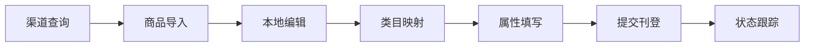
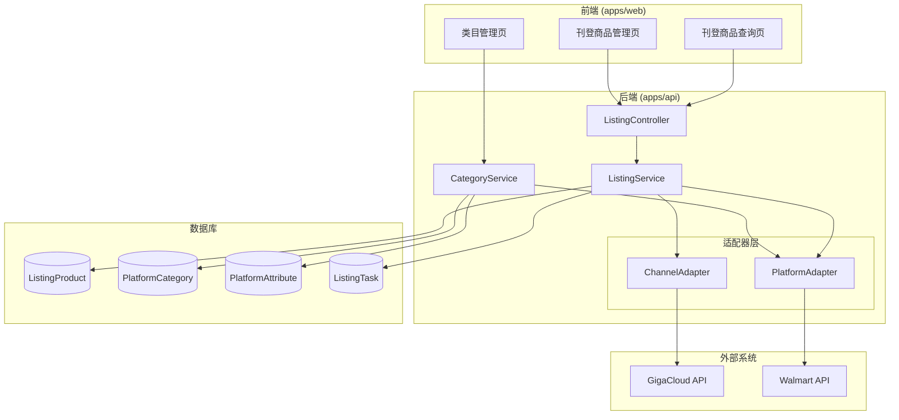
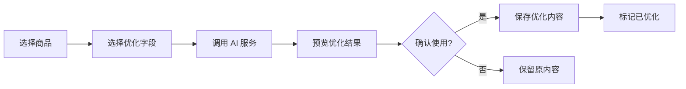

# Design Document - 商品刊登模块

## Overview

商品刊登模块是一个独立的商品管理和发布系统，用于从渠道获取完整商品详情，在本地进行编辑加工，然后刊登到目标平台。该模块与现有的价格/库存同步系统完全独立，拥有独立的数据模型和业务逻辑。

### 核心功能流程



## Architecture

### 系统架构



### 模块结构

```
apps/api/src/modules/
├── listing/                    # 刊登模块
│   ├── listing.module.ts
│   ├── listing.controller.ts
│   ├── listing.service.ts
│   └── dto/
│       ├── query-listing.dto.ts
│       ├── import-listing.dto.ts
│       └── submit-listing.dto.ts
├── platform-category/          # 平台类目模块
│   ├── platform-category.module.ts
│   ├── platform-category.controller.ts
│   └── platform-category.service.ts

apps/web/src/pages/
├── listing/                    # 刊登页面
│   ├── ListingQuery.tsx        # 商品查询
│   ├── ListingProducts.tsx     # 商品管理
│   ├── ListingDetail.tsx       # 商品详情编辑
│   └── CategoryBrowser.tsx     # 类目浏览
```

## Components and Interfaces

### 1. ListingService

负责刊登商品的核心业务逻辑。

```typescript
interface ListingService {
  // 从渠道查询商品详情
  queryFromChannel(channelId: string, skus: string[]): Promise<ChannelProductDetail[]>;
  
  // 导入商品到刊登店铺
  importProducts(shopId: string, products: ImportProductDto[]): Promise<ImportResult>;
  
  // 获取刊登商品列表
  getListingProducts(query: ListingQueryDto): Promise<PaginatedResult<ListingProduct>>;
  
  // 获取单个商品详情
  getListingProduct(id: string): Promise<ListingProduct>;
  
  // 更新商品信息
  updateListingProduct(id: string, data: UpdateListingDto): Promise<ListingProduct>;
  
  // 删除商品
  deleteListingProducts(ids: string[]): Promise<void>;
  
  // 提交刊登
  submitListing(shopId: string, productIds: string[], categoryId: string): Promise<ListingTask>;
  
  // 获取刊登任务状态
  getListingTask(taskId: string): Promise<ListingTask>;
}
```

### 2. PlatformCategoryService

负责平台类目和属性管理。

```typescript
interface PlatformCategoryService {
  // 同步平台类目
  syncCategories(platformId: string): Promise<SyncResult>;
  
  // 获取类目树
  getCategoryTree(platformId: string, parentId?: string): Promise<CategoryNode[]>;
  
  // 搜索类目
  searchCategories(platformId: string, keyword: string): Promise<Category[]>;
  
  // 获取类目属性
  getCategoryAttributes(platformId: string, categoryId: string): Promise<CategoryAttribute[]>;
}
```

### 3. Channel Adapter 扩展

扩展现有渠道适配器，添加商品详情查询方法。采用灵活的数据结构支持不同渠道的差异化字段。

```typescript
// 渠道商品详情 - 通用字段 + 原始数据
interface ChannelProductDetail {
  // 通用必填字段
  sku: string;
  title: string;
  price: number;
  stock: number;
  currency: string;
  
  // 通用可选字段
  description?: string;
  mainImageUrl?: string;
  imageUrls?: string[];
  videoUrls?: string[];
  
  // 标准化属性（从原始数据提取）
  standardAttributes: {
    mpn?: string;
    upc?: string;
    brand?: string;
    weight?: number;
    weightUnit?: string;
    length?: number;
    width?: number;
    height?: number;
    lengthUnit?: string;
    assembledWeight?: number;
    assembledLength?: number;
    assembledWidth?: number;
    assembledHeight?: number;
    shippingFee?: number;
    characteristics?: string[];
    placeOfOrigin?: string;
    categoryCode?: string;
    category?: string;
  };
  
  // 渠道特有字段（不同渠道结构不同）
  channelSpecificFields: Record<string, any>;
  
  // 渠道原始响应数据（完整保存用于调试和扩展）
  rawData: Record<string, any>;
}

// 渠道适配器接口扩展
interface ChannelAdapter {
  // 现有方法...
  
  // 新增：获取商品完整详情（调用详情+价格+库存三个接口）
  fetchProductDetails(skus: string[]): Promise<ChannelProductDetail[]>;
  
  // 新增：获取渠道支持的属性字段定义
  getAttributeDefinitions(): ChannelAttributeDefinition[];
}

// 渠道属性定义（用于前端展示和映射）
interface ChannelAttributeDefinition {
  key: string;           // 属性键名
  label: string;         // 显示名称
  type: 'string' | 'number' | 'boolean' | 'array' | 'object';
  path: string;          // 在 rawData 中的路径，如 "attributes.Main Color"
  description?: string;  // 属性说明
}
```

### 渠道属性映射示例

不同渠道的属性字段差异处理：

```typescript
// GigaCloud 渠道属性定义
const gigaCloudAttributes: ChannelAttributeDefinition[] = [
  { key: 'mpn', label: 'MPN', type: 'string', path: 'mpn' },
  { key: 'whiteLabel', label: '白标', type: 'string', path: 'whiteLabel' },
  { key: 'comboFlag', label: '组合商品', type: 'boolean', path: 'comboFlag' },
  { key: 'overSizeFlag', label: '超大件', type: 'boolean', path: 'overSizeFlag' },
  { key: 'mainColor', label: '主色', type: 'string', path: 'attributes.Main Color' },
  { key: 'mainMaterial', label: '主材质', type: 'string', path: 'attributes.Main Material' },
  { key: 'sellerStore', label: '卖家店铺', type: 'string', path: 'sellerInfo.sellerStore' },
  // ... 更多渠道特有字段
];

// 其他渠道可以定义自己的属性列表
const otherChannelAttributes: ChannelAttributeDefinition[] = [
  // 根据渠道 API 返回的字段定义
];
```

### 4. Platform Adapter 扩展

扩展 Walmart 适配器，添加类目和刊登相关方法。

```typescript
interface WalmartListingAdapter {
  // 获取类目树
  getCategories(): Promise<WalmartCategory[]>;
  
  // 获取类目属性
  getCategoryAttributes(categoryId: string): Promise<WalmartAttribute[]>;
  
  // 创建商品
  createItem(item: WalmartItemPayload): Promise<WalmartItemResponse>;
  
  // 更新商品
  updateItem(sku: string, item: WalmartItemPayload): Promise<WalmartItemResponse>;
  
  // 获取商品状态
  getItemStatus(sku: string): Promise<WalmartItemStatus>;
}
```

## Data Models

### 1. ListingProduct（刊登商品）

采用灵活的 JSON 字段设计，支持不同渠道的差异化属性：

```prisma
model ListingProduct {
  id              String   @id @default(uuid())
  shopId          String   @map("shop_id")
  channelId       String   @map("channel_id")
  
  // 基本信息（通用字段）
  sku             String   @db.VarChar(100)
  title           String   @db.VarChar(500)
  description     String?  @db.Text
  
  // 图片（通用）
  mainImageUrl    String?  @map("main_image_url")
  imageUrls       Json?    @map("image_urls")      // string[]
  videoUrls       Json?    @map("video_urls")      // string[]
  
  // 价格库存（通用）
  price           Decimal  @db.Decimal(10, 2)
  stock           Int      @default(0)
  currency        String   @default("USD") @db.VarChar(10)
  
  // ========== 渠道原始数据（完整保存，支持扩展）==========
  // 渠道返回的完整原始数据，不同渠道格式不同
  channelRawData  Json?    @map("channel_raw_data")
  
  // 渠道标准化属性（从原始数据提取的常用字段）
  channelAttributes Json?  @map("channel_attributes")
  // 结构示例：{
  //   mpn: string,
  //   upc: string,
  //   brand: string,
  //   weight: number,
  //   weightUnit: string,
  //   length: number,
  //   width: number,
  //   height: number,
  //   lengthUnit: string,
  //   assembledWeight: number,
  //   assembledLength: number,
  //   assembledWidth: number,
  //   assembledHeight: number,
  //   shippingFee: number,
  //   characteristics: string[],
  //   placeOfOrigin: string,
  //   categoryCode: string,
  //   category: string,
  //   customFields: Record<string, any>  // 渠道特有字段
  // }
  
  // ========== 平台刊登数据 ==========
  // 平台类目映射
  platformCategoryId  String?  @map("platform_category_id")
  
  // 平台属性填写值（根据平台类目属性定义填写）
  platformAttributes Json? @map("platform_attributes")
  // 结构示例：{
  //   [attributeId]: value,
  //   ...
  // }
  
  // 平台特有字段（如 Walmart 的 productIdType, productId 等）
  platformSpecificData Json? @map("platform_specific_data")
  
  // ========== 属性映射配置 ==========
  // 渠道属性到平台属性的映射规则
  attributeMapping Json? @map("attribute_mapping")
  // 结构示例：{
  //   "platformAttrId1": "channelAttributes.weight",
  //   "platformAttrId2": "channelRawData.customField",
  //   ...
  // }
  
  // 刊登状态
  listingStatus   ListingStatus @default(draft) @map("listing_status")
  platformItemId  String?  @map("platform_item_id") @db.VarChar(100)
  lastListedAt    DateTime? @map("last_listed_at")
  listingError    String?  @map("listing_error")
  
  // 时间戳
  createdAt       DateTime @default(now()) @map("created_at")
  updatedAt       DateTime @updatedAt @map("updated_at")
  
  // 关联
  shop            Shop     @relation(fields: [shopId], references: [id])
  channel         Channel  @relation(fields: [channelId], references: [id])
  
  @@unique([shopId, sku])
  @@map("listing_products")
}

enum ListingStatus {
  draft           // 草稿
  pending         // 待刊登
  submitting      // 提交中
  listed          // 已刊登
  failed          // 刊登失败
  updating        // 更新中
}
```

### 2. PlatformCategory（平台类目）

```prisma
model PlatformCategory {
  id              String   @id @default(uuid())
  platformId      String   @map("platform_id")
  
  categoryId      String   @map("category_id") @db.VarChar(100)  // 平台类目ID
  categoryPath    String   @map("category_path") @db.VarChar(500) // 类目路径
  name            String   @db.VarChar(200)
  parentId        String?  @map("parent_id") @db.VarChar(100)
  level           Int      @default(1)
  isLeaf          Boolean  @default(false) @map("is_leaf")
  
  createdAt       DateTime @default(now()) @map("created_at")
  updatedAt       DateTime @updatedAt @map("updated_at")
  
  platform        Platform @relation(fields: [platformId], references: [id])
  attributes      PlatformAttribute[]
  
  @@unique([platformId, categoryId])
  @@map("platform_categories")
}
```

### 3. PlatformAttribute（平台属性）

```prisma
model PlatformAttribute {
  id              String   @id @default(uuid())
  categoryId      String   @map("category_id")
  
  attributeId     String   @map("attribute_id") @db.VarChar(100)
  name            String   @db.VarChar(200)
  description     String?
  dataType        String   @map("data_type") @db.VarChar(50)  // string, number, enum, boolean
  isRequired      Boolean  @default(false) @map("is_required")
  isMultiSelect   Boolean  @default(false) @map("is_multi_select")
  maxLength       Int?     @map("max_length")
  enumValues      Json?    @map("enum_values")  // string[]
  
  createdAt       DateTime @default(now()) @map("created_at")
  updatedAt       DateTime @updatedAt @map("updated_at")
  
  category        PlatformCategory @relation(fields: [categoryId], references: [id])
  
  @@unique([categoryId, attributeId])
  @@map("platform_attributes")
}
```

### 4. ListingTask（刊登任务）

```prisma
model ListingTask {
  id              String   @id @default(uuid())
  shopId          String   @map("shop_id")
  
  status          ListingTaskStatus @default(pending)
  totalCount      Int      @default(0) @map("total_count")
  successCount    Int      @default(0) @map("success_count")
  failCount       Int      @default(0) @map("fail_count")
  
  productIds      Json     @map("product_ids")  // string[]
  results         Json?    // { sku: string, success: boolean, error?: string }[]
  
  startedAt       DateTime @default(now()) @map("started_at")
  finishedAt      DateTime? @map("finished_at")
  createdAt       DateTime @default(now()) @map("created_at")
  
  shop            Shop     @relation(fields: [shopId], references: [id])
  
  @@map("listing_tasks")
}

enum ListingTaskStatus {
  pending
  running
  completed
  failed
}
```

## Correctness Properties

*A property is a characteristic or behavior that should hold true across all valid executions of a system-essentially, a formal statement about what the system should do. Properties serve as the bridge between human-readable specifications and machine-verifiable correctness guarantees.*


Based on the prework analysis, the following correctness properties have been identified:

### Property 1: Channel Query Data Completeness
*For any* SKU list queried from a channel, the returned product details should contain data from all three APIs (detail, price, inventory), including title, description, dimensions, price, and stock fields.
**Validates: Requirements 1.1**

### Property 2: Product Filter Correctness
*For any* listing product list and filter criteria (SKU, title, category, shop, channel, status), the filtered results should only contain products that match all specified criteria.
**Validates: Requirements 1.3, 3.5**

### Property 3: Import Data Integrity
*For any* product imported from channel, querying the listing product should return all original fields (title, description, dimensions, attributes, images) with the same values, plus channelId and createdAt timestamp.
**Validates: Requirements 2.1, 2.2, 2.5**

### Property 4: Import Statistics Consistency
*For any* batch import operation, the sum of success count, fail count, and skip count should equal the total number of products submitted for import.
**Validates: Requirements 2.4**

### Property 5: Update Persistence
*For any* listing product update operation with valid data, querying the product after update should return the new values for all modified fields.
**Validates: Requirements 3.3**

### Property 6: Delete Effectiveness
*For any* listing product delete operation (single or batch), the deleted products should no longer be retrievable from the listing product table.
**Validates: Requirements 3.4**

### Property 7: Category Search Relevance
*For any* category search with a keyword, all returned categories should contain the keyword in their name (case-insensitive).
**Validates: Requirements 4.4**

### Property 8: Attribute Required Flag
*For any* category's attribute list, attributes marked as required should have isRequired=true, and the validation should fail if these fields are empty during listing submission.
**Validates: Requirements 5.2, 6.1, 6.2**

### Property 9: Listing Status Update
*For any* successful listing submission, the product's listingStatus should be updated to 'listed' and platformItemId should be set to a non-empty value.
**Validates: Requirements 6.4, 7.3**

### Property 10: Listing Task Creation
*For any* listing submission, a ListingTask record should be created with the correct productIds and initial status of 'pending' or 'running'.
**Validates: Requirements 7.1**

### Property 11: Data Independence
*For any* operation on listing products (create, update, delete), the sync products (Product table) should remain unchanged. Conversely, operations on sync products should not affect listing products.
**Validates: Requirements 8.1, 8.2, 8.4, 8.5**

## AI 内容优化

### AI 优化服务设计

支持使用 AI 优化商品的标题、描述、五点描述和属性字段。

```typescript
interface AIOptimizationService {
  // 优化商品标题
  optimizeTitle(params: {
    originalTitle: string;
    category?: string;
    keywords?: string[];
    platform: string;  // walmart, amazon 等
    maxLength?: number;
  }): Promise<OptimizationResult>;
  
  // 优化商品描述
  optimizeDescription(params: {
    originalDescription: string;
    characteristics?: string[];
    category?: string;
    platform: string;
    maxLength?: number;
  }): Promise<OptimizationResult>;
  
  // 生成/优化五点描述（Bullet Points）
  optimizeBulletPoints(params: {
    originalBulletPoints?: string[];
    characteristics?: string[];
    productInfo: {
      title: string;
      category?: string;
      attributes?: Record<string, any>;
    };
    platform: string;
    count?: number;  // 生成几条，默认5条
  }): Promise<BulletPointsResult>;
  
  // 优化属性值
  optimizeAttributes(params: {
    attributes: Record<string, any>;
    platformAttributes: PlatformAttribute[];  // 平台属性定义
    category?: string;
  }): Promise<AttributeOptimizationResult>;
  
  // 批量优化
  batchOptimize(params: {
    productIds: string[];
    optimizeFields: ('title' | 'description' | 'bulletPoints' | 'attributes')[];
    platform: string;
  }): Promise<BatchOptimizationResult>;
}

interface OptimizationResult {
  original: string;
  optimized: string;
  suggestions?: string[];  // 其他建议
  confidence: number;      // 置信度 0-1
}

interface BulletPointsResult {
  original?: string[];
  optimized: string[];
  suggestions?: string[];
}

interface AttributeOptimizationResult {
  original: Record<string, any>;
  optimized: Record<string, any>;
  changes: {
    key: string;
    original: any;
    optimized: any;
    reason: string;
  }[];
}
```

### AI 优化配置

```prisma
// 在 ListingProduct 中添加 AI 优化相关字段
model ListingProduct {
  // ... 现有字段 ...
  
  // AI 优化数据
  aiOptimizedData Json? @map("ai_optimized_data")
  // 结构：{
  //   title?: { original: string, optimized: string, usedAt?: Date },
  //   description?: { original: string, optimized: string, usedAt?: Date },
  //   bulletPoints?: { original: string[], optimized: string[], usedAt?: Date },
  //   attributes?: { original: Record, optimized: Record, usedAt?: Date }
  // }
  
  // 是否使用 AI 优化后的内容
  useAiOptimized Boolean @default(false) @map("use_ai_optimized")
}
```

### AI 优化工作流



### AI 服务集成

预留 AI 服务接口，支持多种 AI 提供商：

```typescript
interface AIProvider {
  name: string;
  optimize(prompt: string, options?: AIOptions): Promise<string>;
}

// 支持的 AI 提供商
type AIProviderType = 'openai' | 'claude' | 'custom';

// AI 配置
interface AIConfig {
  provider: AIProviderType;
  apiKey?: string;
  endpoint?: string;
  model?: string;
  temperature?: number;
  maxTokens?: number;
}
```

## Error Handling

### Channel API Errors
- 网络超时：重试3次，每次间隔递增
- 认证失败：提示用户检查渠道配置
- SKU不存在：标记为查询失败，继续处理其他SKU
- 限流：等待后重试，显示进度

### Platform API Errors
- 类目同步失败：记录错误，允许手动重试
- 刊登验证失败：返回具体字段错误信息
- 刊登提交失败：记录错误到ListingTask，支持重试

### Data Validation Errors
- 必填字段缺失：阻止提交，提示具体字段
- 字段格式错误：显示格式要求
- 图片URL无效：警告但不阻止

## Testing Strategy

### Unit Testing
- 使用 Jest 进行单元测试
- 测试 Service 层的业务逻辑
- 测试数据转换和验证函数
- Mock 外部 API 调用

### Property-Based Testing
- 使用 fast-check 库进行属性测试
- 每个属性测试运行至少 100 次迭代
- 测试标注格式：`**Feature: product-listing, Property {number}: {property_text}**`

### Integration Testing
- 测试 Controller 到 Service 的完整流程
- 测试数据库操作的正确性
- 使用测试数据库隔离测试数据

### Test Coverage Goals
- Service 层：>80% 覆盖率
- 核心业务逻辑：100% 覆盖率
- 属性测试覆盖所有正确性属性
